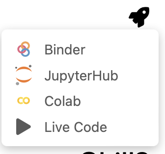
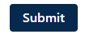
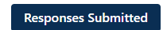

# 📖 Making Sure You Get Credit


## 📚 Learning Objectives

I am sure you all want to get credit for the work you do, this is your guide. 

## 📖 Introduction

When you encounter a webpage with a ❓ icon, it means that you have to complete a task. This task can be a quiz, a coding exercise, or a discussion question. 

1. To access the assignment, you need to open the notebook in JupyterLab. Sorry, you can't complete the assignment on your local machine.



## Starting the Assignment

1. Open the notebook in JupyterLab.
2. Read the instructions carefully.
3. Run the initialization block of code to get started. You can do this by pressing `Shift + Enter` or clicking the `Run` button in the toolbar.

## Types of Questions

### Multiple Choice Questions

We have multiple choice questions that you can answer by selecting the correct option. To view the code block, run the cell by pressing `Shift + Enter`.

#### Run the code block below to display the question:

the code block will look like this:

```python
# Run this block of code by pressing Shift + Enter to display the question
from questions._11_formal_and_natural_language_q import Question4
Question4().show()
```

#### Respond

select the correct option. There is only one correct answer.

#### Submit

Press the `Submit` button. 



if your submission is received, you will see a message like this:




