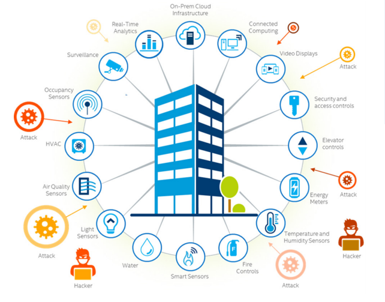
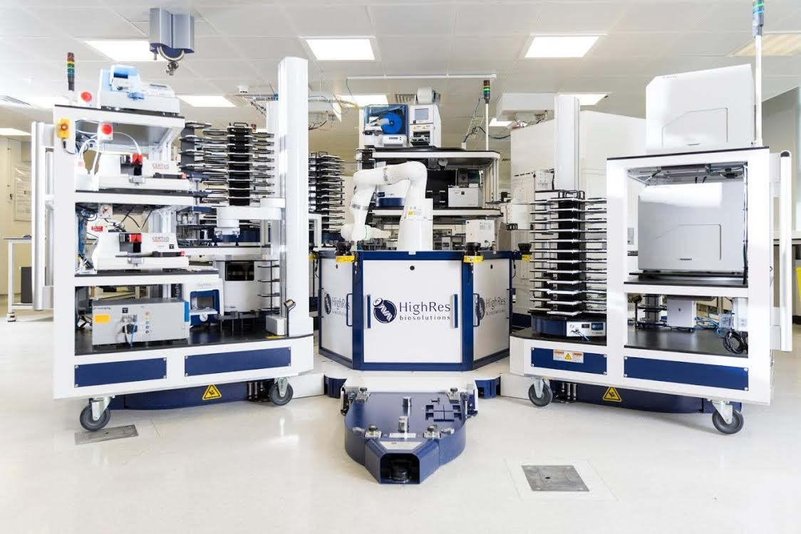
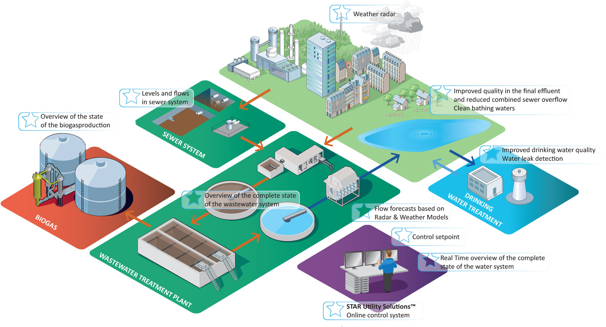
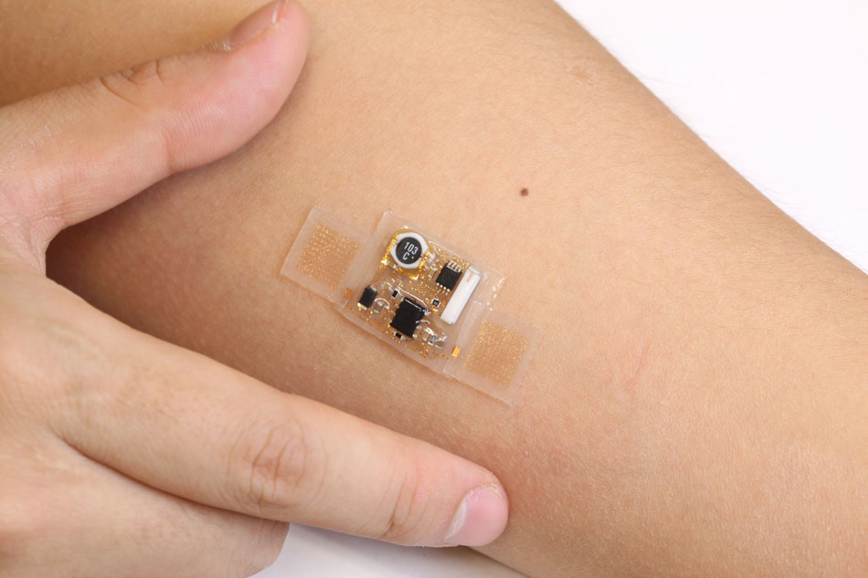
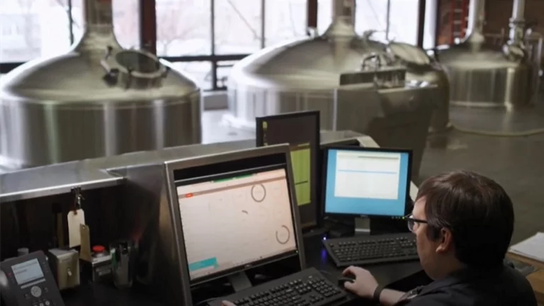
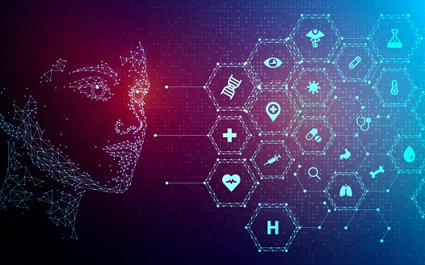

# 📖 Programming, Design, and Engineering 🛠️

## Programming in Engineering: Use Cases Across Drexel’s Departments

At Drexel University, programming transcends disciplines, offering transformative solutions across all engineering departments. Here’s how programming empowers innovation in each area:

## 1. Architectural Engineering

- **Smart Buildings**: Develop algorithms to optimize energy consumption and control HVAC systems in real-time.
- **Structural Simulations**: Use finite element analysis (FEA) software to simulate and model building stresses under extreme conditions.
- **Digital Twins**: Create virtual models of physical buildings for monitoring, diagnostics, and predictive maintenance.

## 2. Chemical and Biological Engineering

- **Reaction Simulations**: Code models to simulate chemical reactions, optimizing yields and reducing waste.
- **Bioprocess Engineering**: Use machine learning to optimize fermentation processes or cell culture conditions.
- **Drug Discovery**: Write computational scripts for molecular docking and analyzing protein-ligand interactions.

## 3. Civil, Architectural, and Environmental Engineering

- **Infrastructure Monitoring**: Design systems to process IoT data for real-time bridge and building health monitoring.
- **Traffic Flow Optimization**: Program simulations to optimize urban traffic patterns and reduce congestion.
- **Water Treatment Models**: Develop software for simulating contaminant removal in water treatment plants.

## 4. Computer and Electrical Engineering

- **Embedded Systems**: Program microcontrollers for robotics, IoT devices, and wearables.
- **Signal Processing**: Use Python to analyze and filter complex signals in communication systems.
- **Renewable Energy**: Create control algorithms for optimizing power output in solar and wind farms.

## 5. Mechanical Engineering

- **Robotics**: Write control software for autonomous robots, including path planning and real-time decision-making.
- **Thermal Simulations**: Develop models for heat transfer in mechanical systems, improving energy efficiency.
- **Additive Manufacturing**: Automate 3D printing workflows and optimize material usage with custom scripts.

## 6. Materials Science and Engineering

- **Materials Discovery**: Use machine learning to identify promising materials for energy storage, semiconductors, or biomaterials.
- **Microscopy Image Analysis**: Automate the analysis of electron microscopy data to identify material defects or structures.
- **Computational Materials Science**: Simulate molecular dynamics to predict material properties.

## 7. Environmental Engineering

- **Climate Modeling**: Write scripts to analyze climate data and predict long-term environmental trends.
- **Wastewater Treatment**: Develop algorithms to optimize chemical dosing in treatment plants.
- **Air Quality Monitoring**: Process large datasets from sensors to identify pollution trends and hotspots.

## 8. Biomedical Engineering

- **Medical Imaging**: Program tools for analyzing MRI or CT scan images, aiding in diagnostics.
- **Prosthetics and Wearables**: Write software to interface with sensors and motors in assistive devices.
- **Bioinformatics**: Analyze genomic data to uncover patterns linked to diseases or traits.

## 9. Systems Engineering

- **Process Optimization**: Automate manufacturing workflows and logistics to minimize downtime and maximize efficiency.
- **Predictive Maintenance**: Write algorithms that analyze sensor data to predict equipment failures.
- **Control Systems**: Code simulations for complex systems like power grids or manufacturing plants.

## 10. Engineering Management

- **Data-Driven Decisions**: Develop dashboards that integrate real-time project data for informed decision-making.
- **Risk Analysis**: Automate Monte Carlo simulations to assess project risks and cost implications.
- **Workflow Optimization**: Build custom tools to streamline project management and resource allocation.

## 11. Drexel’s Cross-Departmental Initiatives

- **Smart Cities**: Collaborate on interdisciplinary projects combining civil, electrical, and environmental engineering to design future-ready urban spaces.
- **AI in Engineering**: Apply machine learning models to optimize processes in fields like mechanical design, material discovery, and biomedical diagnostics.
- **Sustainable Energy Systems**: Integrate programming to model and design next-generation energy solutions.

## Programming: The Engineer’s Edge

Programming equips engineers across all disciplines to:

1. Solve complex, real-world problems.
2. Simulate and optimize systems for peak performance.
3. Leverage big data and AI to drive innovation.

At Drexel University, programming is more than a tool—it’s the gateway to engineering the future. Let’s start building it together!
